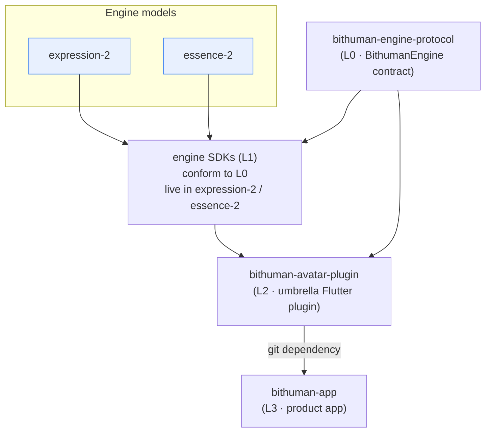

# bitHuman — Org Architecture Map

> Internal repository map for the `bithuman-product` org. This is the authoritative
> grouping of every repo by role, with the client-stack dependency layering.
>
> **Not the public landing page.** `profile/README.md` is the public-facing org page
> rendered on github.com/bithuman-product and is intentionally kept visitor-oriented;
> this file is the internal architecture reference and is **not** auto-rendered as the
> org profile. Each repo's group + tech are also encoded as GitHub topics
> (`engine`, `client-stack`, `backend`, `frontend`, `generative`, `public`, `fork`,
> `rnd`, `archived`) so the org repo list is self-grouping.

## Groups at a glance

| Group | Repos | Role |
|---|---|---|
| **Engine** | expression-2, essence-2, expression-1, essence-1 | The four avatar models (native engines + training + inference). |
| **Client stack** | bithuman-engine-protocol (L0) → engine SDKs (L1, in expression-2 / essence-2) → bithuman-avatar-plugin (L2) → bithuman-app (L3); plus bithuman-sdk (v1 monorepo) | The on-device app delivery stack, layered L0→L3. |
| **Backend** | platform | Dev / test / deploy orchestration. |
| **Frontend** | imaginex-ui | Web UI (marketing + product), Vercel. |
| **Generative** | realtime-video-gen (Dream) | Real-time text-to-video. |
| **Public** | bithuman-sdk-public, homebrew-bithuman, public-docs, .github | Externally published mirrors / docs / org metadata. |
| **Fork** | bithuman-livekit-swift | Upstream fork. |
| **R&D** | playground | Experiments, not productionized. |
| **Archived** | bithuman-apps | Read-only legacy reference apps. |

## Client-stack dependency layering

The Apple-Silicon app is assembled in four layers. Each layer depends only on the one
below it.

- **L0 — bithuman-engine-protocol**: the shared `BithumanEngine` contract (Swift
  protocol + Dart engine registry) every engine SDK conforms to. INVARIANT #1 is
  asserted here.
- **L1 — engine SDKs**: per-engine adapters that conform to L0. They live inside the
  `expression-2` and `essence-2` repos (Layer-1 `sdk/`), symmetric across engines.
- **L2 — bithuman-avatar-plugin**: the engine-agnostic umbrella Flutter plugin. It
  statically aggregates N engine SDKs (expression-2 required, essence-2 optional) and
  depends on L0 via git + the engine SDKs via podspec.
- **L3 — bithuman-app**: the macOS / Apple-Silicon Flutter product app. Consumes L2 as
  a **git dependency** (pubspec + bootstrap). This is the only externally-visible build
  edge in the stack.

The legacy **bithuman-sdk** v1 monorepo (Swift + Python) is a separate client-stack
member: the private source of truth published outward to `bithuman-sdk-public` + PyPI.

## Every repo

### Engine — the four avatar models
| Repo | What it is |
|---|---|
| **expression-2** | Expression v2 — real-time, motion-driven talking-head. Multi-backend C-ABI (GPU torch-CUDA / CPU int8 / Apple ANE CoreML). Engine + training/distillation + inference/serve. |
| **essence-2** | Essence v2 — audio-driven talking-head, two tiers: quality (GPU-only, DiT + LivePortrait) and light (GPU/ANE/CPU). Engine + training + inference/serve. |
| **expression-1** | Expression v1 — on-device Apple-Silicon talking-head (Swift/MLX DiT). Backs frozen `?model=expression`. |
| **essence-1** | Essence v1 — original cloud audio-driven generation (libessence C/C++, `.imx`) + language SDK bindings. Backs frozen `?model=essence`. |

### Client stack — L0 → L3
| Repo | Layer | What it is |
|---|---|---|
| **bithuman-engine-protocol** | L0 | Shared `BithumanEngine` contract (Swift protocol + Dart registry). |
| *(engine SDKs)* | L1 | Per-engine adapters in `expression-2` / `essence-2`. |
| **bithuman-avatar-plugin** | L2 | Engine-agnostic umbrella Flutter plugin; aggregates N engine SDKs. |
| **bithuman-app** | L3 | Product app (macOS/Apple Silicon, Flutter); consumes L2 as a git dependency. |
| **bithuman-sdk** | — | v1 on-device runtime monorepo (Swift + Python); private source of truth → `bithuman-sdk-public` + PyPI. |

### Backend
| Repo | What it is |
|---|---|
| **platform** | Unified development, testing, and deployment orchestration for the avatar platform. |

### Frontend
| Repo | What it is |
|---|---|
| **imaginex-ui** | Web UI: marketing site + product app, auto-deployed to Vercel. |

### Generative
| Repo | What it is |
|---|---|
| **realtime-video-gen** | Dream — real-time text-to-video generation engine (LongLive). Backs `?model=dream`. |

### Public — externally published
| Repo | What it is |
|---|---|
| **bithuman-sdk-public** | Public mirror of the SDK — `pip install bithuman`. Generated from the private bithuman-sdk monorepo. |
| **homebrew-bithuman** | The Homebrew tap: `bithuman-cli` and future formulae. |
| **public-docs** | Source for docs.bithuman.ai (Astro Starlight + OpenAPI). |
| **.github** | Org metadata — profile README + this architecture map + community-health files. |

### Fork / R&D / Archived
| Repo | Group | What it is |
|---|---|---|
| **bithuman-livekit-swift** | fork | Upstream LiveKit Swift fork. |
| **playground** | rnd | Experimental ML projects and prototypes, not productionized. |
| **bithuman-apps** | archived | Read-only legacy reference apps (Flutter + native Apple Silicon). |
